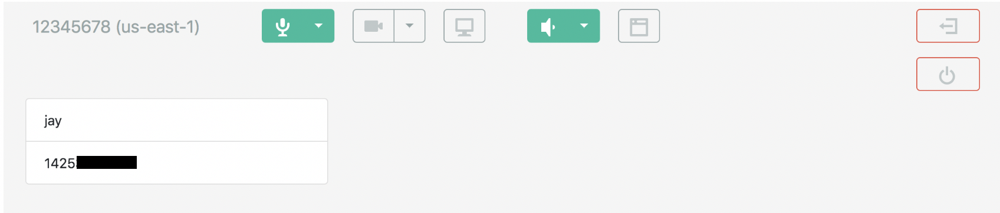

# PSTN Integration with Amazon Chime SDK Meetings

Example solution for configuring PSTN Caller integration with Amazon Chime SDK meetings using Amazon Chime Voice Connector and FreeSWITCH.

## On this Page
- [Project Overview](#project-overview)
- [Architecture Overview](#architecture-overview)
- [Getting Started](#getting-started)
- [Setup](#setup)
- [Cleaning up](#cleaning-up)
- [Conclusion](#conclusion)
- [License Summary](#license-summary)


## Project Overview
The purpose of this project is to provide an example Interactive Voice Response (IVR) application and steps to allow PSTN callers to participate in Amazon Chime SDK meetings.  This solution uses Amazon Chime Voice Connector and an open source softswitch called [FreeSWITCH](https://freeswitch.com/). A phone menu is configured for dial-in callers to enter an Amazon Chime SDK meeting.

## Architecture Overview
The following diagram outlines the solution flow beginning with an Amazon Chime SDK meeting being started. A PSTN caller calls in to the phone number assigned in the Amazon Chime Voice Connector.  This triggers the FreeSWITCH server to interact with the PSTN caller through a voice menu.  The caller is joined to their desired meeting by entering their meeting ID. You can also [enable voice streaming in the Amazon Chime Voice Connector](https://docs.aws.amazon.com/chime/latest/ag/start-kinesis-vc.html) to stream audio from your meeting to Amazon Kinesis. Once the audio is streamed to Amazon Kinesis, you can use other AWS services for added analytics. For example, you can use services like Amazon Transcribe, Amazon Comprehend, and Amazon SageMaker with the audio stream. You can also store the audio in Amazon Simple Storage Service (Amazon S3).


### Description
This solution uses the following services: [Amazon Chime SDK](https://aws.amazon.com/chime/), [Amazon Chime Voice Connector](https://docs.aws.amazon.com/chime/latest/ag/voice-connectors.html), [Amazon Elastic Compute Cloud (EC2)](https://aws.amazon.com/ec2/), and open source softswitch software [FreeSWITCH](https://freeswitch.com/).

Using Amazon Chime SDK meetings, you can create a custom meeting application for users to start or join calls over web browsers or mobile. However, you may also seek to support callers from Public Switched Telephone Networks (PSTN) phones dialing in to your Amazon Chime SDK meetings. This may include callers that have weak or no internet access and/or prefer to join the meeting over their PSTN phone. For example, callers could be joining in a café or train station as opposed to those joining from their offices or homes. 

Amazon Chime SDK supports joining via Session Initiation Protocol (SIP). Because of this, you can use Amazon Chime Voice Connector to obtain a phone number, similar to a conference line. This number can be used by users to dial in from their phones to join or start an Amazon Chime SDK meeting. You can use any SIP-enabled Private Branch Exchange (PBX) with IVR application features to create a simple voice menu. This menu prompts the user for a meeting ID and joins the caller’s audio to the meeting. 

The open source softswitch software called FreeSWITCH is used in this solution to handle PSTN connectivity to the Amazon Chime SDK meeting. A voice connector will be created under the Amazon Chime service console and integrated with the FreeSWITCH PBX to provide public phone number connectivity. 


## Getting Started
Before getting started, make sure that you have the following in place:

- An [AWS account](https://aws.amazon.com/premiumsupport/knowledge-center/create-and-activate-aws-account/)
- An Amazon Chime SDK meeting application. If you don’t have an existing meeting application you can follow the instructions on [deploying the serverless browser demo](https://github.com/aws/amazon-chime-sdk-js#deploying-the-serverless-browser-demo) on GitHub
- Permissions to create [Amazon Chime Voice Connectors](https://docs.aws.amazon.com/chime/latest/ag/voice-connectors.html) and [Amazon EC2 instances](https://docs.aws.amazon.com/AWSEC2/latest/UserGuide/iam-policies-for-amazon-ec2.html)
- Basic understanding of [FreeSWITCH](https://freeswitch.org/confluence/display/FREESWITCH/FreeSWITCH+Explained) software and Linux server administration
- Basic understanding of [Amazon Elastic Compute Cloud (EC2) instances](https://aws.amazon.com/ec2/) and [Amazon Chime SDK](https://aws.amazon.com/chime/chime-sdk/)


## Setup

To build this solution, you must use Amazon EC2 and Amazon Chime Voice Connector to connect to the Amazon Chime SDK meeting application. Download all files from this repository's resources folder to configure the IVR application in FreeSWITCH. Below are the high-level steps.  Note, if you choose to use a paid AMI that has FreeSWITCH preinstalled, you can skip step 3:

1.	[Create two Amazon Chime Voice Connectors for inbound and outbound calling](#Create-2-voice-connectors-for-inbound-and-outbound-calling)
2.	[Create an Amazon EC2 instance for the FreeSWITCH server](#Create-an-Amazon-EC2-instance-for-the-FreeSWITCH-server)
3.	[Install and compile FreeSWITCH](#Install-and-compile-FreeSWITCH) 
4.	[Configure FreeSWITCH to connect to Amazon Chime Voice Connector](#Configure-FreeSWITCH-to-connect-to-Amazon-Chime-Voice-Connector) 
5.	[Configure FreeSWITCH with an IVR application that plays a menu and connects the caller to the Amazon Chime SDK meeting](#Configure-FreeSWITCH-with-an-IVR-application-that-plays-a-menu-and-connects-the-caller-to-the-Amazon-Chime-SDK-meeting)
6. [Join your Amazon Chime SDK meeting from a PSTN phone](#Join-your-Amazon-Chime-SDK-meeting-from-a-PSTN-phone)


### Create 2 voice connectors for inbound and outbound calling
The Amazon Chime Voice Connector will be used to connect public phone numbers to your IVR application and the Amazon Chime SDK meeting.

1.	*Log in* to the [Amazon Chime service console](https://console.chime.aws.amazon.com/home/)
2.	On the Left pane under **Calling**, *choose* `Phone number management` and *select* **Provision phone numbers**. *Choose* **Voice Connector** and *press* **Next**. 
3.	Use the search options to select a phone number for your IVR application and *press* **Provision**
4.	On the Left pane under **Calling**, choose voice connectors and select **create new voice connector**
5.	Enter a Name `inbound_FreeSWITCH` and select a region for your inbound voice connector. Change the default selection of **Encryption** to `disabled` for this test environment.
6.	Under the voice connector configuration *choose* the **Origination** tab and *select* enabled. *Press* **New** to add a new inbound route and *enter* the FQDN of your FreeSWITCH server. If you don’t have the FQDN yet, you can come back and enter this after the FreeSWITCH server is installed. Use `5080` for the port, `TCP` for the protocol, and priority and weights of `1`.
7.	Assign the phone number you claimed earlier to this inbound voice connector by choosing the **Phone Numbers** tab and selecting **Assign from inventory**.  *Choose* your phone number and *press* **Assign from inventory**.
8.	Add the outbound voice connector by choosing voice connectors on the left pane under Calling, and selecting create new voice connector
9.	*Enter* a name `outbound_FreeSWITCH` and *select* a region for your outbound voice connector. Leave the default selection of encryption enabled.
10.	Under the voice connector configuration *choose* the **Termination** tab and *select* `enabled`. *Enter* the `IP address` of your FreeSWITCH server in the **Allowed hosts list**. If you don’t have the IP Address yet, you can come back and enter this after the FreeSWITCH server is installed.
11.	After the voice connectors are created, *copy* the **Outbound host name** of both voice connectors in the Chime Service Console. These values will be used later when configuring the FreeSWITCH server

### Create an Amazon EC2 instance for the FreeSWITCH server
The Amazon EC2 instance AMI we will use for this example is a Debian 10 Buster AMI in a `t3a.medium` size. You can skip using the Debian 10 Buster AMI and the **Install and Compile FreeSWITCH** step if you choose to use an AMI with FreeSWITCH preinstalled.

1.	*Log in* to the the [Amazon EC2 service console](https://console.aws.amazon.com/ec2/v2/home)
2.	*Choose* **Instances** on the left pane and *select* **Launch Instance**
3.	Search for **Debian** in the AWS Marketplace to locate the **Debian 10 Buster** AMI and *press* **select** and **continue**
4.	*Choose* the `t3a.medium` size and *choose* **Next**
5.	Select the correct network and subnet that will allow the instance to reach the Internet
6.	Configure **inbound rules** for the Security Group to allow SSH, RTP media, and SIP Signaling to host from the Amazon Chime Voice Connector subnet IP Address ranges

| Port Numbers           | Protocol | IP Address ranges              | Description    |
| -------------          |:--------:| ------------------------------:| -------------- |
| 16384-32767            | udp      | 99.77.253.0/24, 3.80.16.0/23   | Media          |
| 5080, 5060, 5061, 5063 | tcp      |   3.80.16.0/23, 99.77.253.0/24 | Signaling      |
| 22                     | tcp      |    {Your Admin IP Address} /32 | Administration |


7.	*Choose* **Review and Launch** and *select* **Launch**

### Install and compile FreeSWITCH
Install and compile FreeSWITCH on the Amazon EC2 instance to handle the inbound calls to join a meeting and transferring to the Amazon Chime SDK meeting.

1. Follow the **Easy Way** instructions to install and compile FreeSWITCH and dependencies for the Debian 10 Buster operating system. Instructions can be found on the [FreeSWITCH.org website](https://freeswitch.org/confluence/display/FREESWITCH/Debian+10+Buster). Before the compile step to enter command `./configure`, make the following changes to the `modules.conf` file under `/usr/src/freeswitch`:
-	Uncomment lines for `applications/mod_curl` and `Languages/mod_v8`
-	Comment out line for `applications/mod_enum`
2.	Continue with the build commands as follows:

```
./configure
make
make install
```

Take note of the FreeSWITCH configuration locations:

------------------------------------------------------------------------------
-------------------------- FreeSWITCH configuration --------------------------

  Locations:
  
      prefix:          /usr/local/FreeSWITCH
      confdir:         /usr/local/FreeSWITCH/conf
      certsdir:        /usr/local/FreeSWITCH/certs
      scriptdir:       /usr/local/FreeSWITCH/scripts
      soundsdir:       /usr/local/FreeSWITCH/sounds
------------------------------------------------------------------------------

### Configure FreeSWITCH to connect to Amazon Chime Voice Connector 
The following steps will be used to set up TLS to the outbound voice connector and edit FreeSWITCH configuration files to connect to the voice connectors. 


1.	Generate certificates with the following commands using the name of your FreeSWITCH instance. You may need to add executable permissions to the gentls_cert (ex: `chmod +x gentls_cert`)

The `gentls_cert` utility is located in the **/usr/src/freeswitch/scripts** directory. The certs will be created in **/usr/local/freeswitch/certs**. 

```
./gentls_cert setup -cn <FreeSWITCH server FQDN> -alt DNS:<FreeSWITCH server fqdn> -org <your server domain>

./gentls_cert create_server -cn <FreeSWITCH server FQDN> -alt DNS: <FreeSWITCH server fqdn> -org <your server domain>
```

2.	Copy the generated certificate files from the default directory (**/usr/local/freeswitch/certs**) to the **/etc/freeswitch/tls** directory. 

3.	Modify the SIP profile to enable TLS. Edit the **external.xml** file located in the **/usr/local/FreeSWITCH/conf/sip_profiles/** directory to use **/etc/FreeSWITCH/tls/**: 

```
<!-- Location of the agent.pem and cafile.pem ssl certificates (needed for TLS server) -->
    <!--<param name="tls-cert-dir" value="/etc/FreeSWITCH/tls/ "/>-->
```

4.	Modify **vars.xml** In the **/usr/local/FreeSWITCH/conf** directory with the following to change the default password, set the domain value to the FQDN of the FreeSWITCH server, and enable SRTP with the correct cipher

```
<X-PRE-PROCESS cmd="set" data="default_password=<new password here>"/>.
<X-PRE-PROCESS cmd="set" data="domain=<freeswitch_server.example.com>"/>
<X-PRE-PROCESS cmd="set" data="zrtp_secure_media=true"/>
<X-PRE-PROCESS cmd="set" data="rtp_secure_media_outbound=true:AES_CM_128_HMAC_SHA1_80"/>
```

5.	Modify **modules.conf.xml** and **switch.conf.xml** located in the **/usr/local/FreeSWITCH/conf/autoload_configs** directory to enable curl to be used for the IVR application. This application will join the PSTN caller to the Amazon Chime SDK meeting.
- **modules.conf.xml**  - uncomment 

```<!-- <load module="mod_xml_curl"/> -->```

- **switch.conf.xml** – uncomment  

```
<!-- <param name="rtp-start-port" value="16384"/> -->
<!-- <param name="rtp-end-port" value="32768"/> -->
```

6.	Note the ports used for the internal and external SIP Profiles in the **vars.xml** file in case you need to modify these.

```
<!-- Internal SIP Profile -->
  <X-PRE-PROCESS cmd="set" data="internal_auth_calls=true"/>
  <X-PRE-PROCESS cmd="set" data="internal_sip_port=5060"/>
  <X-PRE-PROCESS cmd="set" data="internal_tls_port=5063"/>
  <X-PRE-PROCESS cmd="set" data="internal_ssl_enable=false"/>
  <!-- External SIP Profile -->
  <X-PRE-PROCESS cmd="set" data="external_auth_calls=false"/>
  <X-PRE-PROCESS cmd="set" data="external_sip_port=5080"/>
  <X-PRE-PROCESS cmd="set" data="external_tls_port=5061"/>
  <X-PRE-PROCESS cmd="set" data="external_ssl_enable=true"/>
```

7.	To create a SIP profile configuration in FreeSWITCH to connect to the outbound Voice Connector add a new file. Name this file **vc.xml** in the **/usr/local/FreeSWITCH/conf/sip_profiles/external** directory with below required fields for FreeSWITCH to connect to the outbound Amazon Chime Voice Connector. Use these required parameter values replacing values with your outbound voice connector id that was copied earlier from the Amazon Chime console. See the **example.xml** file in the same directory for more optional parameters. 

```
<include>
  <gateway name="<voice connector id>.voiceconnector.chime.aws">
  <!--/// account username *required* ///-->
  <param name="username" value="not-used"/>
  <!--/// account password *required* ///-->
  <param name="password" value="not-used"/>
  <!--/// proxy host: *optional* same as realm, if blank ///-->
  <param name="proxy" value="<voice connector id>.voiceconnector.chime.aws"/>
  <!--/// do not register ///-->
  <param name="register" value="false"/>
  <!-- which transport to use for register -->
  <param name="tls-version" value="tlsv1.2"/>
  <param name="register-transport" value="tls"/>
  <!--How many seconds before a retry when a failure or timeout occurs -->
  <!--<param name="retry-seconds" value="30"/>-->
  <!--Use the callerid of an inbound call in the from field on outbound calls via this gateway -->
  <param name="caller-id-in-from" value="true"/>
  </gateway>
</include>
```

### Configure FreeSWITCH with an IVR application that plays a menu and connects the caller to the Amazon Chime SDK meeting
1.	Create a new xml file named **chime.xml** for the dialplan in the **/usr/local/FreeSWITCH/conf/dialplan/public** directory. The file content is listed below. Use your voice connector id in the application bridge section. The +17035550122 phone number is a static number that is used for the [Amazon Chime Voice Connector and Amazon Chime SDK integration](https://docs.aws.amazon.com/chime/latest/dg/mtgs-sdk-cvc.html)

```
<include>
	<extension name="meeting-ivr">
		<condition field="destination_number" expression="^\+1">
	  		<!-- call the script to collect the meeting ID and resolve the join token -->
			<action application="javascript" data="JoinMeeting.js" /> 
			<!-- bridge the call to the voice connector with the join token as an INVITE parameter -->
			<action application="bridge" data="{sip_invite_params=X-chime-join-token=${join-token}}sofia/gateway/<voice connector id>.voiceconnector.chime.aws/+17035550122" />
	  </condition>
	</extension>
</include>
```
2.	Add script to play a menu for PSTN callers to join the meeting. Copy the [JoinMeeting script with audio files](https://github.com/aws-samples/amazon-chime-sdk-pstn-integration/tree/master/resources). Add the **JoinMeeting.js** file to the **/usr/local/FreeSWITCH/scripts** directory. Add the 2 wav files (**please_enter_id.wav** and **now_join.wav**) to the **/usr/local/FreeSWITCH/sounds** directory

### Join your Amazon Chime SDK meeting from a PSTN phone
1.	Start an Amazon Chime SDK meeting with an 8 digit numeric meeting ID (e.g. 12345678). You can modify the **JoinMeeting.js** file to change your meeting ID format if you have different meeting ID criteria.
2.	Call in to the phone number you assigned to your Amazon Chime Voice Connector and when prompted, enter your meeting ID (12345678)
3.	Your call should now be connected as a participant in the Amazon Chime SDK meeting.  The following is an example screenshot. 

 
4.	As an option, you can [enable streaming](https://docs.aws.amazon.com/chime/latest/ag/start-kinesis-vc.html) on your outbound voice connector to capture the audio from your meeting for storage or analytics in AWS.  Once enabled, your audio is streamed to an Kinesis.  Here you can use other AWS services such as [Amazon Transcribe](https://aws.amazon.com/transcribe/) and [Amazon Comprehend](https://aws.amazon.com/comprehend/) in real-time or on stored audio.


## Cleaning up
To avoid incurring future charges, delete the Amazon EC2 instance, Amazon Chime Voice Connector and the obtained PSTN phone number. Also, remove your Amazon Chime SDK serverless application if you created one for this demo.

## Conclusion
In this solution, you learned how to add the ability for PSTN callers to participate in your Amazon Chime SDK meetings. You also built an open source PBX in AWS and learned about how to obtain a PSTN phone number in Amazon Chime Voice Connector. Now your custom Amazon Chime SDK meetings can include callers that do not have an internet connection suitable for audio. You can also include callers who prefer to use their PSTN phone to join. For more information on Amazon Chime Voice Connector streaming and transcription, see this GitHub [sample project](https://github.com/aws-samples/amazon-chime-voiceconnector-transcription) for Amazon Chime Voice Connector streaming. Learn more about [building a meeting application using the Amazon Chime SDK](https://aws.amazon.com/blogs/business-productivity/building-a-meeting-application-using-the-amazon-chime-sdk/) to create and customize your own experience.


## License Summary
This sample code is made available under a modified MIT license. See the LICENSE file.
